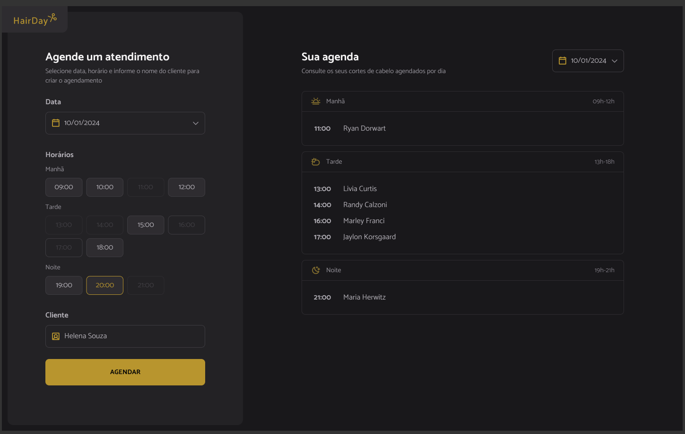

# HairDay

___

Uma aplicação web desenvolvida para o agendamento de clientes em uma barbearia, combinando funcionalidades modernas com um design atrativo. Este projeto é uma demonstração prática de como construir uma aplicação eficiente utilizando ferramentas e tecnologias avançadas.

---

## Sobre o Projeto

O **HairDay** foi criado com o objetivo de facilitar o agendamento de horários em barbearias, oferecendo uma interface intuitiva e de fácil uso. Além disso, o projeto apresenta boas práticas de desenvolvimento, como modularização e organização de código.

---

## Tecnologias e Ferramentas Utilizadas

- **Webpack**: Utilizado para empacotamento e otimização dos arquivos.
- **Babel**: Permite usar recursos modernos do JavaScript em navegadores mais antigos.
- **JsonServer**: Configurado como uma API mock para simular o backend.
- **Day.js**: Biblioteca leve para manipulação e formatação de datas.

---

## Funcionalidades

- Interface para visualização e agendamento de horários.
- Gerenciamento simples e prático de horários disponíveis.
- Manipulação precisa de datas utilizando o **Day.js**.
- Simulação de API com o **JsonServer**.

---

## Design da Página

**Página Modelo:**

---

